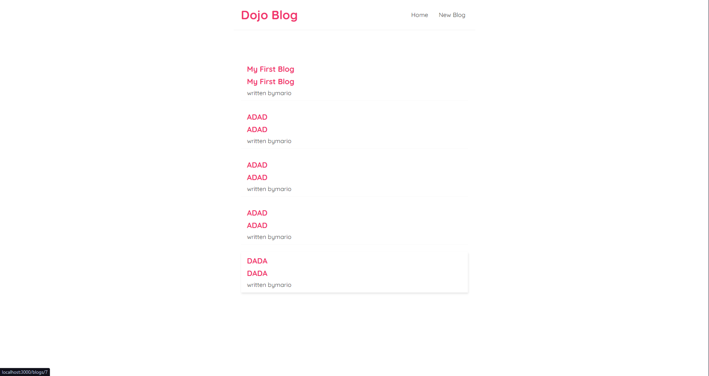
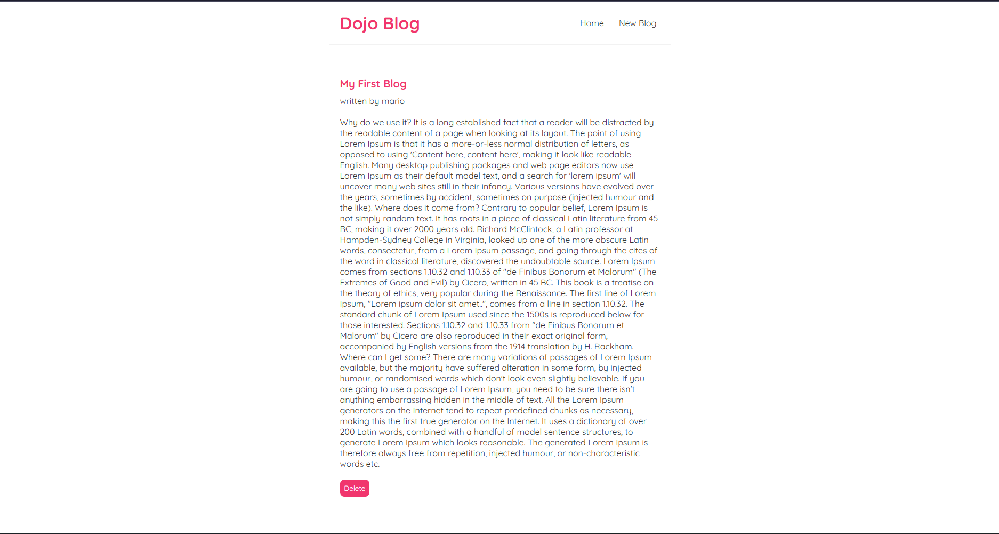
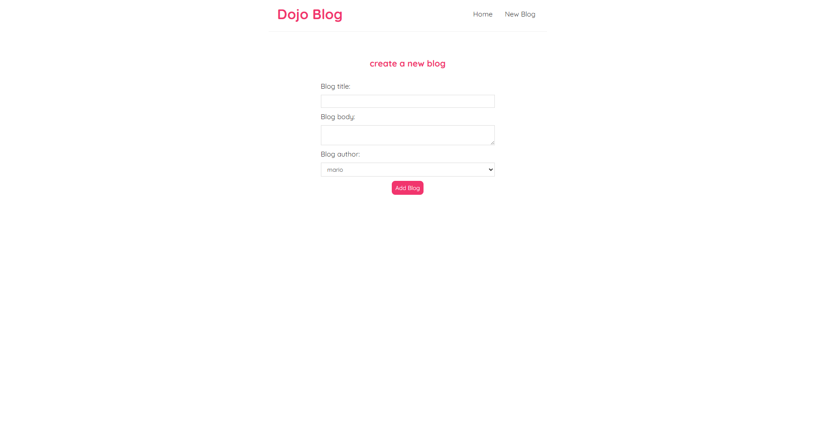
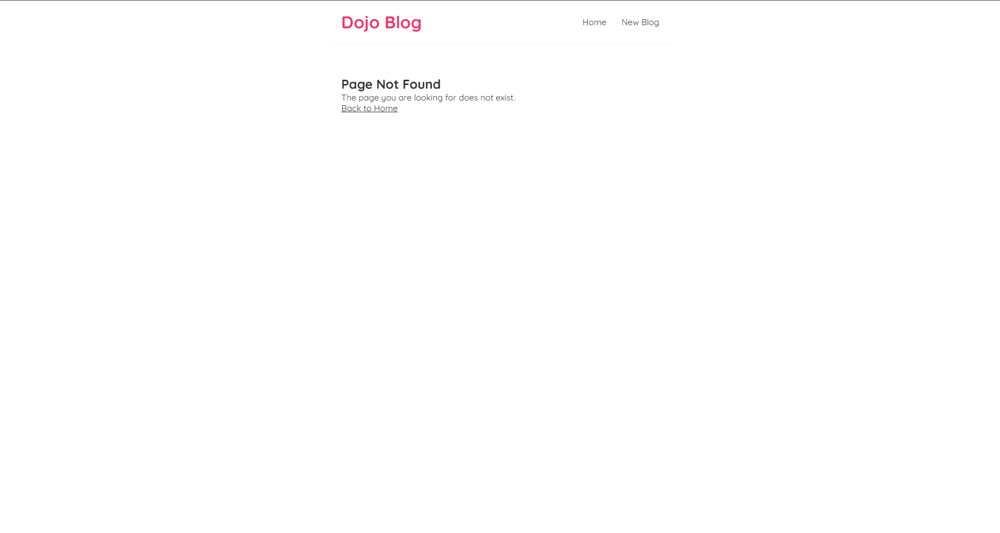

# Dojo Blog
A blog web app built with React. Browse, read, create, and delete blog posts with client-side routing and a custom data-fetching hook.

---

### 📦 Stack
- **React 18** (Create React App)
- **React Router v5**
- **CSS**
- **json-server** (local dev API)

---

### ✨ Quick start
```
npm install
npx json-server --watch data/db.json --port 8000
npm start
```

---

### 🤖 How it works
The `useFetch` custom hook handles all API calls with built-in loading state, error handling, and an AbortController to cancel requests on unmount:
- **Custom hook** — `useFetch` returns `{ data, isPending, error }` for any endpoint
- **Client-side routing** — React Router v5 handles `/`, `/create`, `/blogs/:id`, and a 404 catch-all
- **CRUD** — Create new posts via form, delete from the details page, all synced to json-server

---

### 🖼 Pages

**Home** — lists all blog posts fetched from the API



---

**Blog post** — full post view with a delete button



---

**Create** — form to write and publish a new post



---

**404** — catch-all for unknown routes with a back link



---

### 📁 Project structure
```
src/
  App.js            # Router setup and route definitions
  Navbar.js         # Nav links to Home and New Blog
  Home.js           # Fetches and lists all blogs
  BlogList.js       # Renders blog preview cards
  BlogDetails.js    # Single blog view with delete
  Create.js         # Form to create a new blog post
  NotFound.js       # 404 fallback page
  useFetch.js       # Custom hook for data fetching
  index.css         # Global styles
```

---

### 👤 Author
**Ashik** — [github.com/Ashik](https://github.com/Ahsyx)
